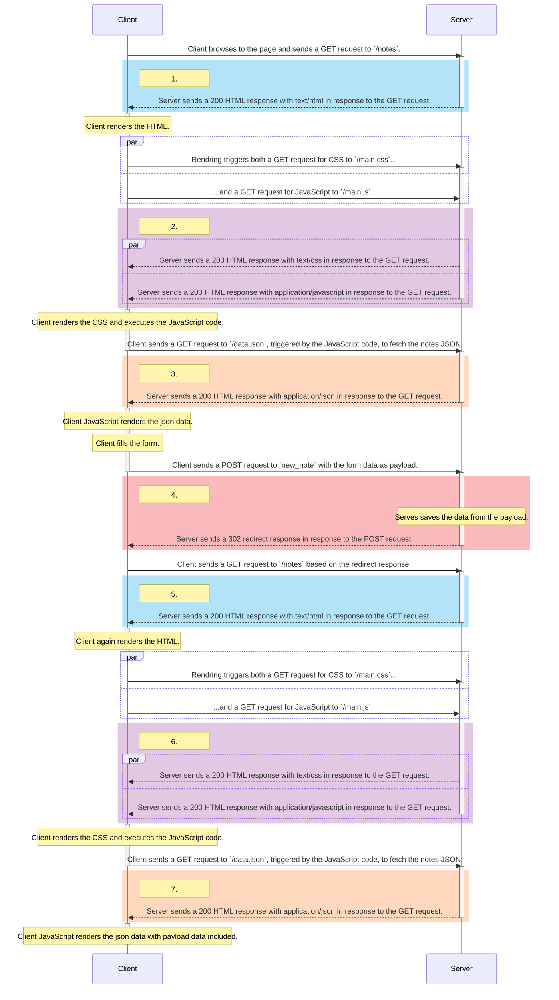

# 0.4: New note diagram
## Image of first response

## Image of second response

## Diagram
Diagram request **base URL is `https://studies.cs.helsinki.fi/exampleapp`**.

```mermaid
sequenceDiagram
    participant Client
    participant Server
    Client->>Server: Client browses to the page and sends a GET request to `/notes`.
    activate Server
    rect rgba(0, 162, 232, 0.3)
    note right of Client: 1.
    Server-->>Client: Server sends a 200 HTML response with text/html in response to the GET request.
    deactivate Server
    end
    activate Client
    Note over Client: Client renders the HTML.
    par
    deactivate Client
    Client->>Server: Rendring triggers both a GET request for CSS to `/main.css`...
    activate Server
    and
    Client->>Server: ...and a GET request for JavaScript to `/main.js`.
    end
    rect rgba(163, 73, 164, 0.3)
    note right of Client: 2.
    par
    Server-->>Client: Server sends a 200 HTML response with text/css in response to the GET request.
    and
    Server-->>Client: Server sends a 200 HTML response with application/javascript in response to the GET request.
    deactivate Server
    end
    end
    activate Client
    note over Client: Client renders the CSS and executes the JavaScript code.
    Client->>Server: Client sends a GET request to `/data.json`, triggered by the JavaScript code, to fetch the notes JSON.
    deactivate Client
    activate Server
    rect rgba(255, 127, 39, 0.3)
    note right of Client: 3.
    Server-->>Client: Server sends a 200 HTML response with application/json in response to the GET request.
    deactivate Server
    end
    activate Client
    note over Client: Client JavaScript renders the json data.
    note over Client: Client fills the form.
    Client->>Server: Client sends a POST request to `new_note` with the form data as payload.
    deactivate Client
    activate Server
    rect rgba(237, 28, 36, 0.3)
    note right of Client: 4.
    note over Server: Serves saves the data from the payload.
    Server-->>Client: Server sends a 302 redirect response in response to the POST request.
    deactivate Server
    end
    Client->>Server: Client sends a GET request to `/notes` based on the redirect response.
    activate Server
    rect rgba(0, 162, 232, 0.3)
    note right of Client: 5.
    Server-->>Client: Server sends a 200 HTML response with text/html in response to the GET request.
    deactivate Server
    end
    activate Client
    Note over Client: Client again renders the HTML.
    par
    deactivate Client
    Client->>Server: Rendring triggers both a GET request for CSS to `/main.css`...
    activate Server
    and
    Client->>Server: ...and a GET request for JavaScript to `/main.js`.
    end
    rect rgba(163, 73, 164, 0.3)
    note right of Client: 6.
    par
    Server-->>Client: Server sends a 200 HTML response with text/css in response to the GET request.
    and
    Server-->>Client: Server sends a 200 HTML response with application/javascript in response to the GET request.
    deactivate Server
    end
    end
    activate Client
    note over Client: Client renders the CSS and executes the JavaScript code.
    Client->>Server: Client sends a GET request to `/data.json`, triggered by the JavaScript code, to fetch the notes JSON.
    deactivate Client
    activate Server
    rect rgba(255, 127, 39, 0.3)
    note right of Client: 7.
    Server-->>Client: Server sends a 200 HTML response with application/json in response to the GET request.
    deactivate Server
    end
    activate Client
    note over Client: Client JavaScript renders the json data with payload data included.
    deactivate Client
```