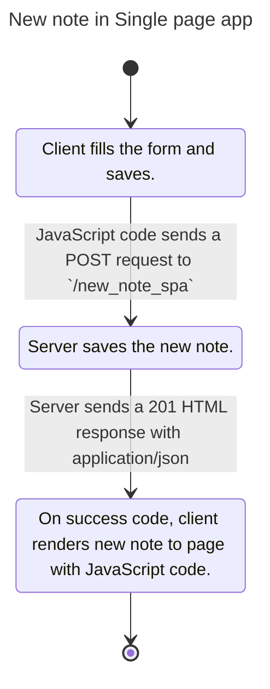

# 0.6: New note in Single page app diagram

## Diagram
Diagram request **base URL is `https://studies.cs.helsinki.fi/exampleapp`**.

```mermaid
---
title: New note in Single page app
---
stateDiagram-v2
    state "Client fills the form and saves." as s1
    state "Server saves the new note." as s2
    state "On success code, client renders new note to page with JavaScript code." as s3
    [*] --> s1
    s1 --> s2: JavaScript code sends a POST request to `/new_note_spa`
    s2 --> s3: Server sends a 201 HTML response with application/json
    s3 --> [*]
```