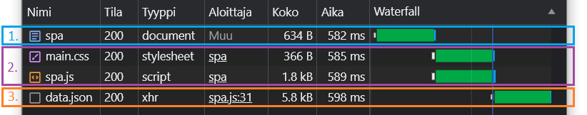
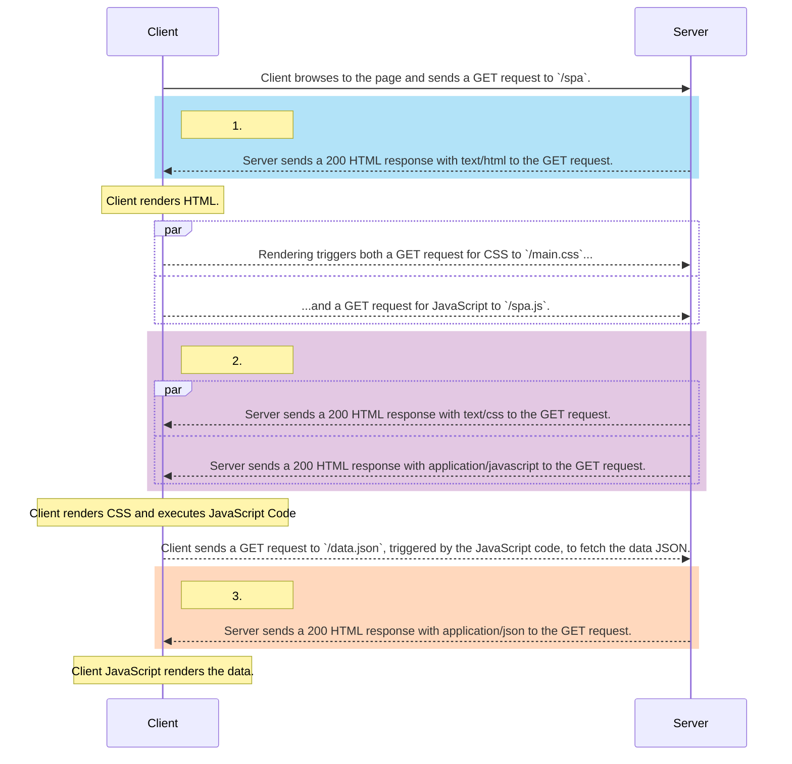

# 0.5: Single page app diagram

## Image of the HTML response

## Diagram
Diagram request **base URL is `https://studies.cs.helsinki.fi/exampleapp`**.

```mermaid
sequenceDiagram
    participant Client
    participant Server
    Client->>Server: Client browses to the page and sends a GET request to `/spa`.
    rect rgba(0, 162, 232, 0.3)
    note right of Client: 1.
    Server-->>Client: Server sends a 200 HTML response with text/html to the GET request.
    end
    note over Client: Client renders HTML.
    par
    Client-->>Server: Rendering triggers both a GET request for CSS to `/main.css`...
    and
    Client-->>Server: ...and a GET request for JavaScript to `/spa.js`.
    end
    rect rgba(163, 73, 164, 0.3)
    note right of Client: 2.
    par
    Server-->>Client: Server sends a 200 HTML response with text/css to the GET request.
    and
    Server-->>Client: Server sends a 200 HTML response with application/javascript to the GET request.
    end
    end
    note over Client: Client renders CSS and executes JavaScript Code
    Client-->>Server: Client sends a GET request to `/data.json`, triggered by the JavaScript code, to fetch the data JSON.
    rect rgba(255, 127, 39, 0.3)
    note right of Client: 3.
    Server-->>Client: Server sends a 200 HTML response with application/json to the GET request.
    end
    note over Client: Client JavaScript renders the data.
```